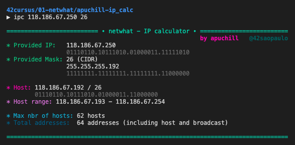
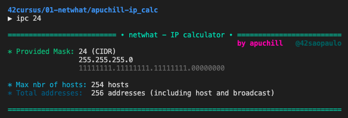
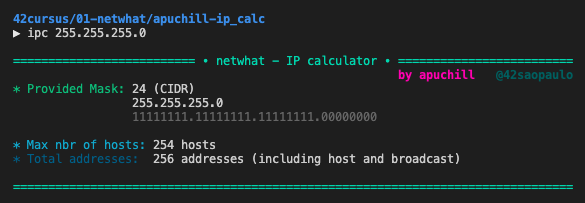

<h1 align="center">
	IP Calculator
</h1>

<p align="center">
	Program to calculate information about IP addresses,<br>
	providing <i>just</i> what is requested on the <b><a href="https://github.com/appinha/42cursus/tree/master/01-netwhat">42 cursus' netwhat</a> test</b>.
</p>

<p align="center">
	
	
	
	
	
</p>

<h3 align="center">
	<a href="#-motivation">Motivation</a>
	<span> · </span>
	<a href="#%EF%B8%8F-usage">Usage</a>
	<span> · </span>
	<a href="#-tips">Tips</a>
</h3>

---

## 💭 Motivation

This program was developed to help cadets from <a href="https://github.com/appinha/42cursus">École 42</a> on studying for and taking the **netwhat test**. For further information about this, please refer to the [netwhat repo](https://github.com/appinha/42cursus/tree/master/01-netwhat).

## 🛠️ Usage

### Requirements

The program is written in C language and thus needs the **`gcc` compiler** and some standard **C libraries** to run.

### Installation

Simply clone the repository:

```shell
$ git clone https://github.com/appinha/ip_calc-netwhat-42cursus.git
```

### Running

Go to the cloned directory:

```shell
$ cd ip_calc-netwhat-42cursus
```

For information about the given **IP address**, run:

```shell
$ sh ipc.sh [IP address] [subnet mask or CIDR]
```



For information about the given **subnet mask/CIDR**, run:

```shell
$ sh ipc.sh [subnet mask or CIDR]
```





## 💡 Tips

Set an **alias** for running the program, for instance:

```shell
alias ipc="cd path/to/ip_calc-netwhat-42cursus && sh ipc.sh $1 $2"
```

Then, it suffices to run:

```shell
ipc [IP address] [subnet mask or CIDR]
```

or:

```shell
ipc [subnet mask or CIDR]
```
